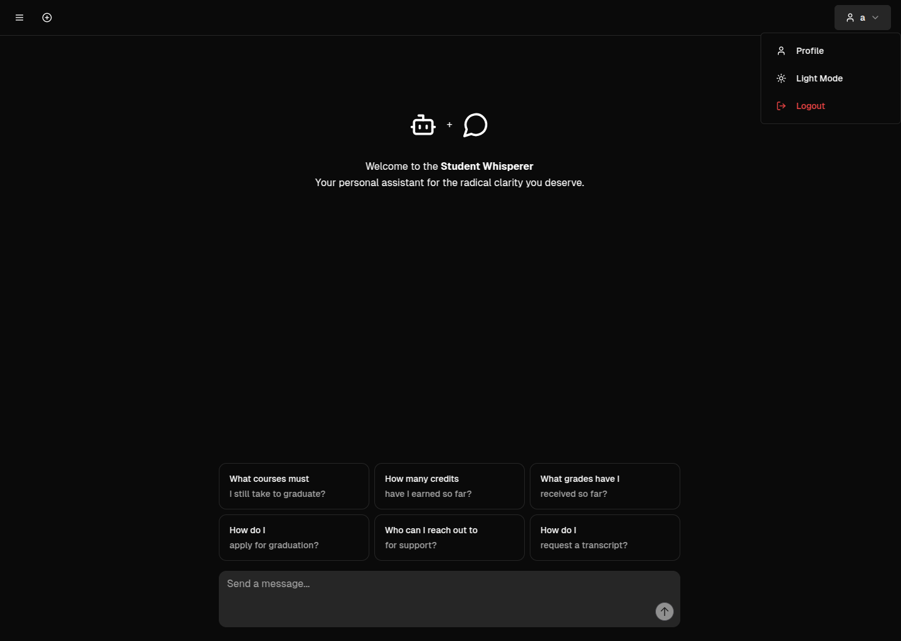

# StudentWhisperer

A modern educational platform that combines student information management with AI-powered assistance.



## Overview

StudentWhisperer is an integrated platform designed to enhance the educational experience for students through:

- **AI Chatbot Support**: Get answers to questions about courses, assignments, and academic concepts
- **Student Profile Management**: Track academic progress, grades, and course information
- **Secure Authentication**: Multiple login options including traditional credentials and Microsoft SSO
- **Responsive UI**: Modern interface that works across desktop and mobile devices

## Features

- **AI Chatbot**
  - Natural language processing to answer student questions
  - Context-aware responses based on your academic profile
  - Ability to provide academic guidance and explain concepts

- **Student Information System**
  - View course enrollments and grades
  - Track progress toward degree completion
  - Access academic records and feedback

- **User Management**
  - Secure authentication with JWT tokens
  - Profile management (update email, password)
  - Microsoft Azure AD Single Sign-On integration

- **Administrative Tools**
  - Usage metrics and analytics
  - User management capabilities

## Technology Stack

- **Frontend**: React, TypeScript, Tailwind CSS
- **Backend**: Python, Flask
- **AI Integration**: Azure OpenAI Services
- **Search**: Azure Cognitive Search
- **Database**: SQL Server
- **Authentication**: JWT tokens, Azure AD integration
- **Deployment**: Docker, Docker Compose

## Getting Started

### Prerequisites

- Docker and Docker Compose
- Node.js (for local frontend development)
- Python 3.8+ (for local backend development)

### Running with Docker

1. Clone the repository
```bash
git clone <repository-url>
cd v4-StudentWhisperer
```

2. Start the application using Docker Compose
```bash
docker-compose up
```

3. Access the application at http://localhost

### Local Development Setup

#### Frontend

1. Navigate to the frontend directory
```bash
cd frontend
```

2. Install dependencies
```bash
npm install
```

3. Start the development server
```bash
npm run dev
```

#### Backend

1. Navigate to the backend directory
```bash
cd backend
```

2. Create a Python virtual environment
```bash
python -m venv venv
source venv/bin/activate  # On Windows: venv\Scripts\activate
```

3. Install dependencies
```bash
pip install -r requirements.txt
```

4. Set up environment variables (create a .env file based on .env.sample)
```bash
cp .env.sample .env
# Edit the .env file with your configurations
```

5. Start the Flask server
```bash
python app.py
```

## Configuration

### Environment Variables

The backend requires several environment variables to be set. Create a `.env` file in the backend directory based on the `.env.sample` provided:

```
# Azure OpenAI Configuration
azure-openai-api-key=""
azure-openai-endpoint=""
azure-openai-embedding-deployment-id=""
azure-openai-gpt-model-deployment-id=""
azure-openai-api-version=""

# Azure Search Configuration
azure-search-service-endpoint=""
azure-search-index=""
azure-search-datasource=""
azure-search-skillset=""
azure-search-indexer=""
azure-search-admin-key=""
azure-search-semantic-config=""

# SQL Database Configuration
sql-server=""
sql-db=""
sql-user=""
sql-password=""
```

These environment variables are used for:
- Connecting to Azure OpenAI for the chatbot functionality
- Setting up Azure Cognitive Search for information retrieval
- Connecting to the SQL database for student information

## API Documentation

The backend provides several API endpoints:

- Authentication: `/api/auth/login`, `/api/auth/register`, `/api/auth/azure-token`
- Profile: `/api/me`, `/api/student/courses`
- Chat: `/api/chat`
- Account Management: `/api/student/update-email`, `/api/student/update-password`

For a complete list of endpoints and their documentation, see the backend code or run the application and explore the API.

## Contributing

We welcome contributions to StudentWhisperer! Please feel free to submit issues or pull requests.

## License

This project is licensed under the Apache License 2.0.
